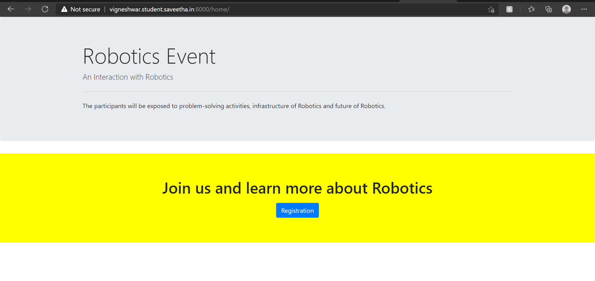
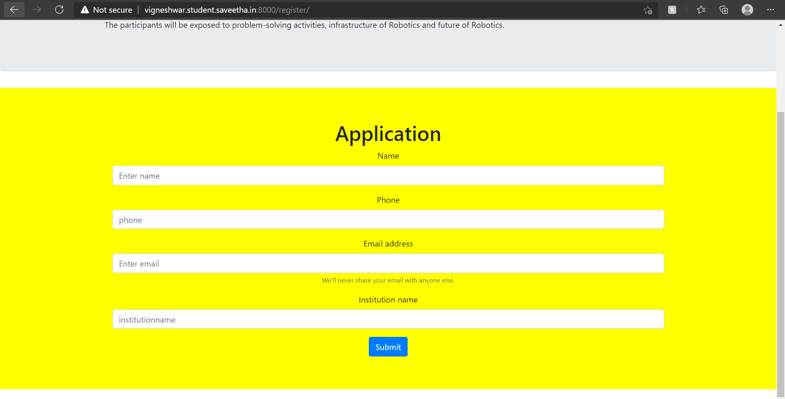
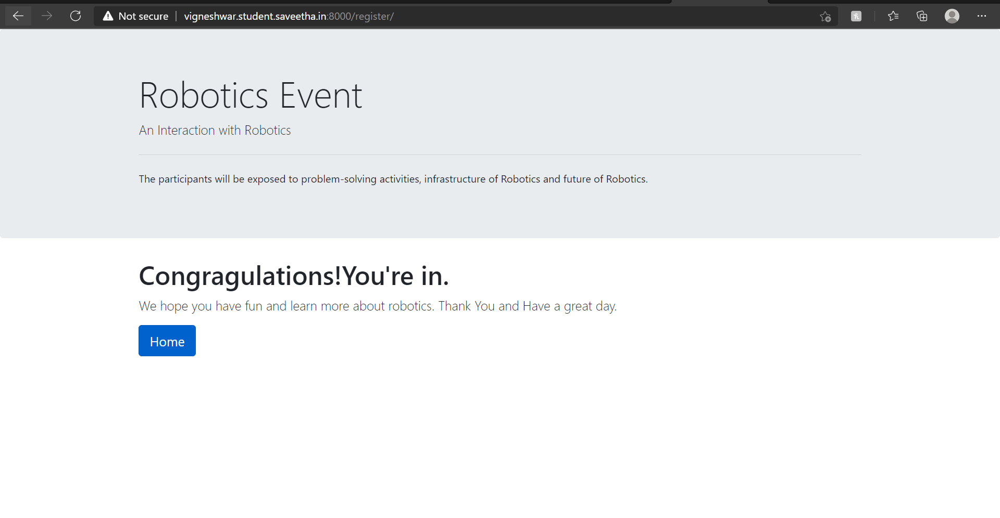
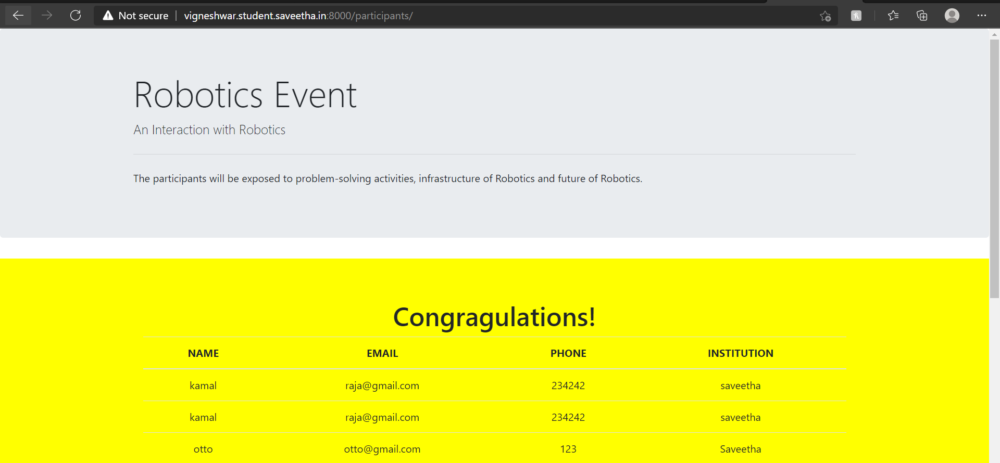

# WebApplication for Event Registration

## AIM:
To create a UX design and develop a web application for event registration.
## DESIGN STEPS:
## PROGRAM:

## home.html:
```
<!doctype html>
<html lang="en">

<head>
    <!-- Required meta tags -->
    <meta charset="utf-8">
    <meta name="viewport" content="width=device-width, initial-scale=1, shrink-to-fit=no">

    <!-- Bootstrap CSS -->
    <link rel="stylesheet" href="https://maxcdn.bootstrapcdn.com/bootstrap/4.0.0/css/bootstrap.min.css"
        integrity="sha384-Gn5384xqQ1aoWXA+058RXPxPg6fy4IWvTNh0E263XmFcJlSAwiGgFAW/dAiS6JXm" crossorigin="anonymous">

    <title>Saveetha Engineering College</title>
</head>

<body>
    <div class="jumbotron">
        <div class="container">
            <h1 class="display-4">Robotics Event</h1>
            <p class="lead">An Interaction with Robotics</p>
            <hr class="my-4">
            <p>The participants will be exposed to problem-solving activities, infrastructure of Robotics and future of
                Robotics.</p>
            <p class="lead">

            </p>
        </div>
    </div>
    <div class="jumbotron jumbotron-fluid" style="background-color:yellow;">
                <div class="container  text-center">
    <div class="container">
        <div class="row">
            <div class="col-12">

                <h1>Join us and learn more about Robotics</h1>
                <p class="lead">

                </p>


                <div class="container">
                    <div class="row">
                        <div class="col-12 text-centre">
                            <a href="/register/" class="btn btn-primary" role="button"
                                aria-disabled="true">Registration</button>


                                <!-- Optional JavaScript -->
                                <!-- jQuery first, then Popper.js, then Bootstrap JS -->
                                <script src="https://code.jquery.com/jquery-3.2.1.slim.min.js"
                                    integrity="sha384-KJ3o2DKtIkvYIK3UENzmM7KCkRr/rE9/Qpg6aAZGJwFDMVNA/GpGFF93hXpG5KkN"
                                    crossorigin="anonymous"></script>
                                <script src="https://cdnjs.cloudflare.com/ajax/libs/popper.js/1.12.9/umd/popper.min.js"
                                    integrity="sha384-ApNbgh9B+Y1QKtv3Rn7W3mgPxhU9K/ScQsAP7hUibX39j7fakFPskvXusvfa0b4Q"
                                    crossorigin="anonymous"></script>
                                <script src="https://maxcdn.bootstrapcdn.com/bootstrap/4.0.0/js/bootstrap.min.js"
                                    integrity="sha384-JZR6Spejh4U02d8jOt6vLEHfe/JQGiRRSQQxSfFWpi1MquVdAyjUar5+76PVCmYl"
                                    crossorigin="anonymous"></script>
</body>

</html>
```
## register.html:
```
<!doctype html>
<html lang="en">

<head>
    <!-- Required meta tags -->
    <meta charset="utf-8">
    <meta name="viewport" content="width=device-width, initial-scale=1, shrink-to-fit=no">

    <!-- Bootstrap CSS -->
    <link rel="stylesheet" href="https://maxcdn.bootstrapcdn.com/bootstrap/4.0.0/css/bootstrap.min.css"
        integrity="sha384-Gn5384xqQ1aoWXA+058RXPxPg6fy4IWvTNh0E263XmFcJlSAwiGgFAW/dAiS6JXm" crossorigin="anonymous">

    <title>Event Management</title>
</head>

<body>
    <div class="jumbotron">
        <div class="container">
            <h1 class="display-4">Robotics Event</h1>
            <p class="lead">An Interaction with Robotics</p>
            <hr class="my-4">
            <p>The participants will be exposed to problem-solving activities, infrastructure of Robotics and future of
                Robotics.</p>
            <p class="lead">

            </p>
        </div>
    </div>
    <div class="jumbotron jumbotron-fluid" style="background-color: yellow;">
                <div class="container  text-center">
    <div class="container">
        <div class="row">
            <div class="col-12">
                <h1>Application</h1>
            </div>
        </div>

        <form method="POST" action="/register/">
            


            <div class="form-group">
                <label for="name">Name</label>
                <input type="name" class="form-control" name="username" id="username" aria-describedby="emailHelp"
                    placeholder="Enter name">
            </div>
            <div class="form-group">
                <label for="phone">Phone</label>
                <input type="phone" class="form-control" name="phone" id="phone" placeholder="phone">
            </div>
            <div class="form-group">
                <label for="exampleInputEmail1">Email address</label>
                <input type="email" class="form-control" name="exampleInputEmail1" id="exampleInputEmail1"
                    aria-describedby="emailHelp" placeholder="Enter email">
                <small id="emailHelp" class="form-text text-muted">We'll never share your email with anyone
                    else.</small>
            </div>
            <div class="form-group">
                <label for="institutionname">Institution name</label>
                <input type="institutionname" class="form-control" name="institutionname" name="institutionname"
                    id="institutionname" placeholder="institutionname">
            </div>
            <button type="submit" class="btn btn-primary">Submit</button>
        </form>

    </div>

    <!-- Optional JavaScript -->
    <!-- jQuery first, then Popper.js, then Bootstrap JS -->
    <script src="https://code.jquery.com/jquery-3.2.1.slim.min.js"
        integrity="sha384-KJ3o2DKtIkvYIK3UENzmM7KCkRr/rE9/Qpg6aAZGJwFDMVNA/GpGFF93hXpG5KkN"
        crossorigin="anonymous"></script>
    <script src="https://cdnjs.cloudflare.com/ajax/libs/popper.js/1.12.9/umd/popper.min.js"
        integrity="sha384-ApNbgh9B+Y1QKtv3Rn7W3mgPxhU9K/ScQsAP7hUibX39j7fakFPskvXusvfa0b4Q"
        crossorigin="anonymous"></script>
    <script src="https://maxcdn.bootstrapcdn.com/bootstrap/4.0.0/js/bootstrap.min.js"
        integrity="sha384-JZR6Spejh4U02d8jOt6vLEHfe/JQGiRRSQQxSfFWpi1MquVdAyjUar5+76PVCmYl"
        crossorigin="anonymous"></script>
</body>

</html>
```
## participants.html:
```
<!doctype html>
<html lang="en">

<head>
    <!-- Required meta tags -->
    <meta charset="utf-8">
    <meta name="viewport" content="width=device-width, initial-scale=1, shrink-to-fit=no">

    <!-- Bootstrap CSS -->
    <link rel="stylesheet" href="https://maxcdn.bootstrapcdn.com/bootstrap/4.0.0/css/bootstrap.min.css"
        integrity="sha384-Gn5384xqQ1aoWXA+058RXPxPg6fy4IWvTNh0E263XmFcJlSAwiGgFAW/dAiS6JXm" crossorigin="anonymous">

    <title>Saveetha Engineering College</title>
</head>

<body>
    <div class="jumbotron">
        <div class="container">
            <h1 class="display-4">Robotics Event</h1>
            <p class="lead">An Interaction with Robotics</p>
            <hr class="my-4">
            <p>The participants will be exposed to problem-solving activities, infrastructure of Robotics and future of
                Robotics.</p>
            <p class="lead">
                
            </p>
        </div>
    </div>
    <div class="jumbotron jumbotron-fluid" style="background-color: yellow;">
                <div class="container  text-center">
    <div class="container">
        <div class="row">
            <div class="col-12">
                <h1>Congragulations!</h1>
            </div>
        </div>
        <div class="row">
            <div class="col-12">
                <table class="table">
                    <thead>
                        <tr>
                            <th scope="col">NAME</th>
                            <th scope="col">EMAIL</th>
                            <th scope="col">PHONE</th>
                            <th scope="col">INSTITUTION</th>
                        </tr>
                    </thead>
                    <tbody>

                        <tr>
                            <td>kamal</td>
                            <td>raja@gmail.com</td>
                            <td>234242</td>
                            <td>saveetha</td>
                        </tr>

                        <tr>
                            <td>kamal</td>
                            <td>raja@gmail.com</td>
                            <td>234242</td>
                            <td>saveetha</td>
                        </tr>

                        <tr>
                            <td>otto</td>
                            <td>otto@gmail.com</td>
                            <td>123</td>
                            <td>Saveetha</td>
                        </tr>

                        <tr>
                            <td>kala</td>
                            <td>sfsd</td>
                            <td>234</td>
                            <td>sdf</td>
                        </tr>

                        <tr>
                            <td>sdfsd</td>
                            <td>sdf</td>
                            <td>234</td>
                            <td>sdfsd</td>
                        </tr>

                        <tr>
                            <td>fsdfsd</td>
                            <td>sdf</td>
                            <td>sdf</td>
                            <td>sdf</td>
                        </tr>

                        <tr>
                            <td>sdf</td>
                            <td>sdf</td>
                            <td>sdf</td>
                            <td>sdf</td>
                        </tr>

                        <tr>
                            <td>sdf</td>
                            <td>sdf</td>
                            <td>sdf</td>
                            <td>sdf</td>
                        </tr>

                        <tr>
                            <td>sdf</td>
                            <td>sdf</td>
                            <td>sdf</td>
                            <td>sdf</td>
                        </tr>

                        <tr>
                            <td>sdf</td>
                            <td>sdf</td>
                            <td>sdf</td>
                            <td>sdf</td>
                        </tr>

                        <tr>
                            <td>sdf</td>
                            <td>sdf</td>
                            <td>sdf</td>
                            <td>sdf</td>
                        </tr>

                        <tr>
                            <td>sdf</td>
                            <td>sdf</td>
                            <td>sdf</td>
                            <td>sdf</td>
                        </tr>

                        <tr>
                            <td>sdf</td>
                            <td>sdf</td>
                            <td>sdf</td>
                            <td>sdf</td>
                        </tr>

                        <tr>
                            <td>sdf</td>
                            <td>sdf</td>
                            <td>sdf</td>
                            <td>sdf</td>
                        </tr>

                    </tbody>
                </table>
            </div>
        </div>
        <div class="row">
            <div class="col-12 text-center">
                <a href="/home/" class="btn btn-primary btn-lg" role="button">Home</a>
            </div>
        </div>
    </div>

    <!-- Optional JavaScript -->
    <!-- jQuery first, then Popper.js, then Bootstrap JS -->
    <script src="https://code.jquery.com/jquery-3.2.1.slim.min.js"
        integrity="sha384-KJ3o2DKtIkvYIK3UENzmM7KCkRr/rE9/Qpg6aAZGJwFDMVNA/GpGFF93hXpG5KkN"
        crossorigin="anonymous"></script>
    <script src="https://cdnjs.cloudflare.com/ajax/libs/popper.js/1.12.9/umd/popper.min.js"
        integrity="sha384-ApNbgh9B+Y1QKtv3Rn7W3mgPxhU9K/ScQsAP7hUibX39j7fakFPskvXusvfa0b4Q"
        crossorigin="anonymous"></script>
    <script src="https://maxcdn.bootstrapcdn.com/bootstrap/4.0.0/js/bootstrap.min.js"
        integrity="sha384-JZR6Spejh4U02d8jOt6vLEHfe/JQGiRRSQQxSfFWpi1MquVdAyjUar5+76PVCmYl"
        crossorigin="anonymous"></script>
</body>

</html>
```
## success.html:
```
<!doctype html>
<html lang="en">

<head>
    <!-- Required meta tags -->
    <meta charset="utf-8">
    <meta name="viewport" content="width=device-width, initial-scale=1, shrink-to-fit=no">

    <!-- Bootstrap CSS -->
    <link rel="stylesheet" href="https://maxcdn.bootstrapcdn.com/bootstrap/4.0.0/css/bootstrap.min.css"
        integrity="sha384-Gn5384xqQ1aoWXA+058RXPxPg6fy4IWvTNh0E263XmFcJlSAwiGgFAW/dAiS6JXm" crossorigin="anonymous">

    <title>Saveetha Engineering College</title>
</head>

<body>
    <div class="jumbotron">
        <div class="container">
            <h1 class="display-4">Robotics Event</h1>
            <p class="lead">An Interaction with Robotics</p>
            <hr class="my-4">
            <p>The participants will be exposed to problem-solving activities, infrastructure of Robotics and future of
                Robotics.</p>
            <p class="lead">

            </p>
        </div>
    </div>

    <div class="container">
        <div class="row">
            <div class="col-12">

                <h1>Congragulations!You're in.</h1>
                <p class="lead">We hope you have fun and learn more about robotics. Thank You and Have a great day.

                </p>
            <a href="/home/" class="btn btn-primary btn-lg active" role="button" aria-pressed="true">Home</a>
    </div>

                <!-- Optional JavaScript -->
                <!-- jQuery first, then Popper.js, then Bootstrap JS -->
                <script src="https://code.jquery.com/jquery-3.2.1.slim.min.js"
                    integrity="sha384-KJ3o2DKtIkvYIK3UENzmM7KCkRr/rE9/Qpg6aAZGJwFDMVNA/GpGFF93hXpG5KkN"
                    crossorigin="anonymous"></script>
                <script src="https://cdnjs.cloudflare.com/ajax/libs/popper.js/1.12.9/umd/popper.min.js"
                    integrity="sha384-ApNbgh9B+Y1QKtv3Rn7W3mgPxhU9K/ScQsAP7hUibX39j7fakFPskvXusvfa0b4Q"
                    crossorigin="anonymous"></script>
                <script src="https://maxcdn.bootstrapcdn.com/bootstrap/4.0.0/js/bootstrap.min.js"
                    integrity="sha384-JZR6Spejh4U02d8jOt6vLEHfe/JQGiRRSQQxSfFWpi1MquVdAyjUar5+76PVCmYl"
                    crossorigin="anonymous"></script>
</body>

</html>
```
## failed.html:
```
<!doctype html>
<html lang="en">

<head>
    <!-- Required meta tags -->
    <meta charset="utf-8">
    <meta name="viewport" content="width=device-width, initial-scale=1, shrink-to-fit=no">

    <!-- Bootstrap CSS -->
    <link rel="stylesheet" href="https://maxcdn.bootstrapcdn.com/bootstrap/4.0.0/css/bootstrap.min.css"
        integrity="sha384-Gn5384xqQ1aoWXA+058RXPxPg6fy4IWvTNh0E263XmFcJlSAwiGgFAW/dAiS6JXm" crossorigin="anonymous">

    <title>Saveetha Engineering College</title>
</head>

<body>
    <div class="jumbotron">
        <div class="container">
            <h1 class="display-4">Robotics Event</h1>
            <p class="lead">An Interaction with Robotics</p>
            <hr class="my-4">
            <p>The participants will be exposed to problem-solving activities, infrastructure of Robotics and future of
                Robotics.</p>
            <p class="lead">

            </p>
        </div>
    </div>

    <div class="container">
        <div class="row">
            <div class="col-12">

                <h1>Sorry!</h1>
                <p class="lead">Try again next time.Have a good day.

                </p>
    <a href="/home/" class="btn btn-primary btn-lg active" role="button" aria-pressed="true">Home</a>
    </div>

    <!-- Optional JavaScript -->
    <!-- jQuery first, then Popper.js, then Bootstrap JS -->
    <script src="https://code.jquery.com/jquery-3.2.1.slim.min.js"
        integrity="sha384-KJ3o2DKtIkvYIK3UENzmM7KCkRr/rE9/Qpg6aAZGJwFDMVNA/GpGFF93hXpG5KkN"
        crossorigin="anonymous"></script>
    <script src="https://cdnjs.cloudflare.com/ajax/libs/popper.js/1.12.9/umd/popper.min.js"
        integrity="sha384-ApNbgh9B+Y1QKtv3Rn7W3mgPxhU9K/ScQsAP7hUibX39j7fakFPskvXusvfa0b4Q"
        crossorigin="anonymous"></script>
    <script src="https://maxcdn.bootstrapcdn.com/bootstrap/4.0.0/js/bootstrap.min.js"
        integrity="sha384-JZR6Spejh4U02d8jOt6vLEHfe/JQGiRRSQQxSfFWpi1MquVdAyjUar5+76PVCmYl"
        crossorigin="anonymous"></script>
</body>

</html>
```
## views.py:
```
from django.shortcuts import render
from .models import Participant
from django.core.exceptions import ValidationError

# Create your views here.


def home(request):
    context = {}
    return render(request, 'eventapplication/home.html', context)


def register(request):
    context = {}
    if request.method == 'POST':
        p1 = Participant()
        p1.username = request.POST.get('username', '-')
        p1.email = request.POST.get('email', '-')
        p1.phone = request.POST.get('phone', '-')
        p1.institution = request.POST.get('institution', '-')

        if len(Participant.objects.all()) > 15:
            return render(request, 'eventapplication/failed.html', context)
        else:
            p1.save()
            return render(request, 'eventapplication/success.html', context)

    if request.method == 'GET':
        context['username'] = ''
        context['email'] = ''
        context['phone'] = ''
        context['institution'] = ''

    return render(request, 'eventapplication/register.html', context)


def participants(request):
    context = {}

    context['participants'] = Participant.objects.all()

    return render(request, 'eventapplication/participants.html', context)
```
## OUTPUT:





## RESULT:
Thus, the website for event registration is designed and developed and exported to the url 
http://vigneshwar.student.saveetha.in:8000/home/